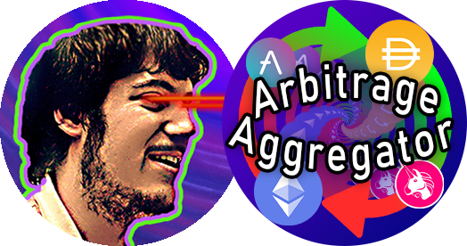

[![Contributors][contributors-shield]][contributors-url]
[![Forks][forks-shield]][forks-url]
[![Stargazers][stars-shield]][stars-url]
[![Issues][issues-shield]][issues-url]
[![MIT License][license-shield]][license-url]
[![LinkedIn][linkedin-shield]][linkedin-url]


<!-- PROJECT LOGO -->
<br />
<p align="center">
  <a href="https://github.com/EvanGottschalk/ArbitrageAggregator">
    
  </a>

  <h3 align="center">ArbitrageAggregator</h3>

  <p align="center">
    A customizable bot for detecting arbitrage opportunities between DeFi exchanges
    <br />
    <a href="https://github.com/EvanGottschalk/ArbitrageAggregator"><strong>Explore the docs »</strong></a>
    <br />
    <br />
    <a href="https://github.com/EvanGottschalk/ArbitrageAggregator">View Demo</a>
    ·
    <a href="https://github.com/EvanGottschalk/ArbitrageAggregator/issues">Report Bug</a>
    ·
    <a href="https://github.com/EvanGottschalk/ArbitrageAggregator/issues">Request Feature</a>
  </p>
</p>


<!-- TABLE OF CONTENTS -->
<details open="open">
  <summary><h2 style="display: inline-block">Table of Contents</h2></summary>
  <ol>
    <li>
      <a href="#about-the-project">About The Project</a>
      <ul>
        <li><a href="#built-with">Built With</a></li>
      </ul>
    </li>
    <li>
      <a href="#getting-started">Getting Started</a>
      <ul>
        <li><a href="#prerequisites">Prerequisites</a></li>
        <li><a href="#installation">Installation</a></li>
      </ul>
    </li>
    <li><a href="#usage">Usage</a></li>
    <li><a href="#roadmap">Roadmap</a></li>
    <li><a href="#contributing">Contributing</a></li>
    <li><a href="#license">License</a></li>
    <li><a href="#contact">Contact</a></li>
    <li><a href="#acknowledgements">Acknowledgements</a></li>
  </ol>
</details>


<!-- ABOUT THE PROJECT -->
## About The Project

[![Product Name Screen Shot][product-screenshot]](https://example.com)


### Built With

* `Python 3.6`
* `web3`
* `json`
* `pandas`
* `DEXcalculator` - This program uses API calls to fetch decentralized exchange balances, which are then used to calculate prices of tokens.


<!-- GETTING STARTED -->
## Getting Started

Getting `ArbitrageAggregator` up and running is easy (and free!).

### Prerequisites

Running `ArbitrageAggregator` requires the `pandas`, `json` and `web3` libraries. One must also create a free account on [Alchemy.com](https://www.alchemy.com/) to obtain an API key.


### Installation

1. To use `ArbitrageAggregator`, one must obtain their own [Alchemy](https://www.alchemy.com/) API key. This is quick, simple, and free to do.
  1a. First, create a free account on [Alchemy.com](https://www.alchemy.com/).
  1b. Next, create a blank app using the "+CREATE APP" button (the app's particular parameters are not relevant to `ArbitrageAggregator`).
  1c. That's it! The new API key will be displayed on the [Alchemy](https://www.alchemy.com/) dashboard.

2. Install the `pandas`, `json` and `web3` libraries, which are listed in `requirements.txt`. The easiest way to do this is with `pip`:
    ```
    pip install -r requirements.txt
    ```

3. Download the `.py` files from this repository (`ArbitrageAggregator.py` and `DEXcalculator.py`)

4. Run `ArbitrageAggregator.py`

5. Congratulations! You can now use `ArbitrageAggregator` to constantly detect arbitrage opportunities between DeFi exchanges!


<!-- USAGE EXAMPLES -->
## Usage

Simply run `ArbitrageAggregator.py` and input your Alchemy API URL to begin collecting data on potential arbitrage opportunities between decentralized exchanges. This data can be used for broader analysis, or to facilitate automated trading.


<!-- ROADMAP -->
## Roadmap

See the [open issues](https://github.com/EvanGottschalk/ArbitrageAggregator/issues) for a list of proposed features (and known issues).


<!-- CONTRIBUTING -->
## Contributing

Contributions are what make the open source community such an amazing place to be learn, inspire, and create. Any contributions you make are **greatly appreciated**.

1. Fork the Project
2. Create your Feature Branch (`git checkout -b feature/AmazingFeature`)
3. Commit your Changes (`git commit -m 'Add some AmazingFeature'`)
4. Push to the Branch (`git push origin feature/AmazingFeature`)
5. Open a Pull Request


<!-- LICENSE -->
## License

Distributed under the GNU GPL-3 License. See `LICENSE` for more information.


<!-- CONTACT -->
## Contact

Evan Gottschalk - [@Fort1Evan](https://twitter.com/Fort1Evan) - evan@fort1e.com

Project Link: [https://github.com/EvanGottschalk/ArbitrageAggregator](https://github.com/EvanGottschalk/ArbitrageAggregator)


<!-- ACKNOWLEDGEMENTS -->
## Acknowledgements

Thinking about contributing to this project? Please do! Your Github username will then appear here.


<!-- MARKDOWN LINKS & IMAGES -->
<!-- https://www.markdownguide.org/basic-syntax/#reference-style-links -->
[contributors-shield]: https://img.shields.io/github/contributors/EvanGottschalk/ArbitrageAggregator.svg?style=for-the-badge
[contributors-url]: https://github.com/EvanGottschalk/ArbitrageAggregator/graphs/contributors
[forks-shield]: https://img.shields.io/github/forks/EvanGottschalk/ArbitrageAggregator.svg?style=for-the-badge
[forks-url]: https://github.com/EvanGottschalk/ArbitrageAggregator/network/members
[stars-shield]: https://img.shields.io/github/stars/EvanGottschalk/ArbitrageAggregator.svg?style=for-the-badge
[stars-url]: https://github.com/EvanGottschalk/ArbitrageAggregator/stargazers
[issues-shield]: https://img.shields.io/github/issues/EvanGottschalk/ArbitrageAggregator.svg?style=for-the-badge
[issues-url]: https://github.com/EvanGottschalk/ArbitrageAggregator/issues
[license-shield]: https://img.shields.io/github/license/EvanGottschalk/ArbitrageAggregator.svg?style=for-the-badge
[license-url]: https://github.com/EvanGottschalk/ArbitrageAggregator/blob/master/LICENSE.txt
[linkedin-shield]: https://img.shields.io/badge/-LinkedIn-black.svg?style=for-the-badge&logo=linkedin&colorB=555
[linkedin-url]: https://linkedin.com/in/EvanGottschalk